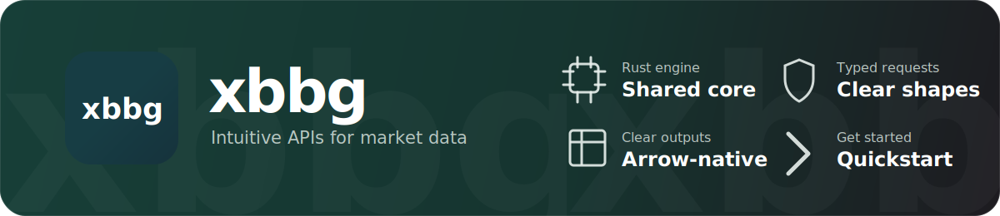

<!-- markdownlint-disable MD013 MD031 MD032 MD033 MD041 MD051 -->
<div align="center">

<p>
  <a href="https://xbbg.org/python/quickstart">
    
  </a>
</p>

[](https://pypi.org/project/xbbg/)
[](https://pypi.org/project/xbbg/)
[](https://anaconda.org/conda-forge/xbbg)
[](https://pepy.tech/project/xbbg)
[](https://github.com/xbbg-org/xbbg/actions/workflows/ci-rust.yml)
[](https://discord.gg/P34uMwgCjC)

**Links:** [Documentation](https://xbbg.org/) · [Quickstart](#quickstart) · [Configuration](#configuration-and-engines) · [Examples notebook](py-xbbg/examples/xbbg_jupyter_examples.ipynb) · [Contributing](CONTRIBUTING.md) · [Changelog](CHANGELOG.md)

</div>

---

<!-- xbbg:latest-release-start -->
Latest release: xbbg==1.2.6 (release: [notes](https://github.com/xbbg-org/xbbg/releases/tag/v1.2.6))
<!-- xbbg:latest-release-end -->

> This `main` branch is the Rust-powered v1 release. For the legacy pure-Python line, use [`release/0.x`](https://github.com/xbbg-org/xbbg/tree/release/0.x).

> **Important:** xbbg is an independent open-source project. It is not affiliated with, endorsed by, sponsored by, or approved by Bloomberg Finance L.P. or its affiliates. Bloomberg, Bloomberg Terminal, B-PIPE, BQL, and related names are trademarks or service marks of their respective owners. xbbg does not grant access to Bloomberg services, data, software, licenses, credentials, or entitlements; users must obtain and use those separately under their own Bloomberg agreements and applicable policies.

## Contents

- [What is xbbg?](#what-is-xbbg)
- [Why xbbg?](#why-xbbg)
- [Installation](#installation)
- [Quickstart](#quickstart)
- [JavaScript and Node](#javascript-and-node)
- [Configuration and engines](#configuration-and-engines)
- [Common API surface](#common-api-surface)
- [Output backends](#output-backends)
- [Async usage](#async-usage)
- [Subscriptions: raw, tick mode, and all fields](#subscriptions-raw-tick-mode-and-all-fields)
- [MCP server](#mcp-server)
- [Troubleshooting](#troubleshooting)
- [Development](#development)
- [Project links](#project-links)

## What is xbbg?

xbbg is a Bloomberg client with Python as the primary surface and companion JavaScript/Node bindings, all backed by a shared Rust engine for request execution, response parsing, Arrow-shaped data movement, async workers, typed errors, and diagnostics.

Use xbbg when you already have Bloomberg access and want higher-level helpers for common request patterns, plus an escape hatch for lower-level Bloomberg service requests.

Core scope:

- request helpers for BDP, BDS, BDH, intraday bars, ticks, BQL, BEQS, BSRCH, BQR, BTA, YAS, and related analytics
- local Bloomberg Desktop API / DAPI by default
- configuration for managed Bloomberg environments, including B-PIPE/SAPI, ZFP leased lines, TLS, failover hosts, SOCKS5, and SDK logging
- sync and async Python APIs backed by the same engine
- output as Narwhals, native xbbg Arrow carriers, PyArrow, pandas, Polars, DuckDB, and other optional Narwhals-backed libraries
- JavaScript/Node bindings in [`js-xbbg`](js-xbbg/README.md)

## Why xbbg?

xbbg's project goal is direct: be the most complete, technically advanced, and performance-focused open-source Bloomberg client for Python workflows, while staying independent of Bloomberg and requiring users to bring their own authorized Bloomberg access.

The short version: if all you need is a tiny one-off `bdp()` wrapper, several packages can work. xbbg is built for the path where that notebook later grows into intraday data, BQL, streaming, B-PIPE/SAPI, ZFP, async services, typed errors, diagnostics, and non-pandas data pipelines.

| Capability | xbbg | raw `blpapi` | pdblp / blp | bbg-fetch | polars-bloomberg |
| --- | --- | --- | --- | --- | --- |
| BDP/BDS/BDH helpers | yes | manual SDK code | yes | yes | partial |
| Intraday bars and ticks | yes | manual SDK code | limited / no | no | partial |
| Streaming subscriptions | yes | manual SDK code | no | no | no |
| BQL, BEQS, BSRCH, BQR, YAS, BTA | broad helper coverage | manual SDK code | limited | limited | partial |
| DAPI, SAPI/B-PIPE, ZFP, TLS, failover, SOCKS5 | configurable engine support | manual SDK code | limited | limited | limited |
| Async worker pools and isolated subscription sessions | yes | application-owned | no | no | no |
| Rust request/parsing engine with Arrow-shaped output | yes | no | no | no | no |
| Output backends beyond pandas | Narwhals, native, PyArrow, pandas, Polars, DuckDB | application-owned | pandas-first | pandas-first | Polars-first |
| Typed errors, diagnostics, field cache, testing helpers | yes | application-owned | limited | limited | limited |
| Usable install footprint (Windows x64, Python 3.14) | xbbg 1.2.2 + narwhals 2.21.0 + blpapi 3.26.3.1 = 22.076 MiB | blpapi 3.26.3.1 = 13.653 MiB | pdblp 0.1.8 + pandas 3.0.3 + blpapi 3.26.3.1 = 88.139 MiB / blp 0.0.4 + pandas 3.0.3 + blpapi 3.26.3.1 = 88.246 MiB | bbg-fetch 2.0.2 + numpy 2.4.4 + pandas 3.0.3 + blpapi 3.26.3.1 = 88.156 MiB | polars-bloomberg 0.5.4 + polars 1.40.1 + blpapi 3.26.3.1 = 191.547 MiB |

Install footprints were measured in clean target directories on this workstation with the usable install recipe for each column: `xbbg + blpapi`, raw `blpapi`, `pdblp + pandas + blpapi`, `blp + pandas + blpapi`, `bbg-fetch + blpapi`, and `polars-bloomberg` (which pulls `blpapi` transitively).
That makes xbbg the best fit in this comparison for teams that want one Bloomberg-connected Python client that can start with simple BDP/BDH calls and scale into institutional transport, async, streaming, diagnostics, and multi-backend data workflows.

## Installation

```cmd
pip install xbbg
```

Conda users can install the conda-forge build:

```cmd
conda install -c conda-forge xbbg
```

Most users should also install Bloomberg's official Python package so xbbg can locate the Bloomberg SDK/runtime:

```cmd
pip install blpapi --index-url=https://blpapi.bloomberg.com/repository/releases/python/simple/
```

Supported Python versions: **3.10 through 3.14**.

Requirements and notes:

- You need an authorized Bloomberg environment: local Terminal/DAPI, SAPI/B-PIPE, or ZFP, depending on your setup.
- If you build from source, stage the Bloomberg C++ SDK with `bash ./scripts/sdktool.sh` on macOS/Linux or `.\\scripts\\sdktool.ps1` on Windows PowerShell.
- If you manage the SDK yourself, set `BLPAPI_ROOT` or use `xbbg.set_sdk_path(...)`.
- On Windows Terminal installs, xbbg automatically probes DAPI runtime roots such as `C:\blp\DAPI` and `C:\Program Files (x86)\Bloomberg\Blp\DAPI` before requiring manual configuration.
- Optional dataframe conversions are installed separately: `xbbg[pyarrow]`, `xbbg[pandas]`, `xbbg[polars]`, or `xbbg[duckdb]`.

Verify the install:

```python
import xbbg

print(xbbg.__version__)
print(xbbg.get_sdk_info())
```

## Quickstart

```python
from xbbg import blp

# Reference data
prices = blp.bdp(["AAPL US Equity", "MSFT US Equity"], "PX_LAST")

# Historical data
hist = blp.bdh("SPX Index", "PX_LAST", "2024-01-01", "2024-12-31")

# Intraday bars
bars = blp.bdib("TSLA US Equity", dt="2024-01-15", interval=5)
```

Common request patterns:

```python
from xbbg import blp

# Multiple fields
info = blp.bdp("NVDA US Equity", ["Security_Name", "GICS_Sector_Name", "PX_LAST"])

# Bloomberg-style overrides
vwap = blp.bdp("AAPL US Equity", "Eqy_Weighted_Avg_Px", VWAP_Dt="20240115")

# Bulk data
holders = blp.bds("AAPL US Equity", "DVD_Hist_All", DVD_Start_Dt="20240101")

# BQL
result = blp.bql("get(px_last) for('AAPL US Equity')")

# Field lookup
fields = blp.bflds(search_spec="vwap")

# Equity screening and constituents
screen = blp.beqs(screen="MyScreen", asof="2024-01-01")
members = blp.index_members("SPX Index", asof="2024-01-02")

# Workflow helpers
active = blp.active_futures("ESA Index", "2024-01-15")
surface = blp.vol_surface("SPX Index", start_date="2024-01-02", end_date="2024-01-05")
resolved = blp.resolve_isins(["US0378331005", "INVALIDISIN000"])
```

For longer walkthroughs and example output shapes, use the [examples notebook](py-xbbg/examples/xbbg_jupyter_examples.ipynb) or [xbbg.org](https://xbbg.org/).

## JavaScript and Node

xbbg also ships experimental Node bindings in [`@xbbg/core`](js-xbbg/README.md). The JS layer uses the same Rust engine through a native N-API addon, so Node can use the same Bloomberg connection modes and request surfaces as Python.

```bash
npm install @xbbg/core
# or
bun add @xbbg/core
```

Packaged native addons are currently provided for macOS arm64, Linux x64, and Windows x64. You still need Bloomberg access plus Bloomberg SDK runtime libraries on the target system.

```ts
import * as xbbg from '@xbbg/core';

xbbg.configure({ host: 'localhost', port: 8194 });

const hist = await xbbg.blp.abdh(['AAPL US Equity'], ['PX_LAST'], '2024-01-01', '2024-12-31');
const ref = await xbbg.blp.abdp(['AAPL US Equity'], ['PX_LAST', 'SECURITY_NAME']);
```

See [`js-xbbg/README.md`](js-xbbg/README.md) for platform packaging, runtime prerequisites, and the current alpha API surface.

For LangChain and LangGraph agents, use [`@xbbg/langgraph`](js-xbbg-langgraph/README.md). It exposes reusable server-side Bloomberg tools backed by `@xbbg/core` without making MCP, a chat app, or a browser integration the core path:

```bash
npm install @xbbg/langgraph @xbbg/core @langchain/core
```

```ts
import { createAllBloombergTools, BLOOMBERG_TOOL_INSTRUCTIONS } from '@xbbg/langgraph';

const tools = createAllBloombergTools({ maxSecurities: 10, maxFields: 10 });
```

Use the existing [`apps/xbbg-mcp`](apps/xbbg-mcp/README.md) package only when you specifically need MCP.

## Configuration and engines

By default, xbbg starts a Rust-backed engine and connects to local Bloomberg Desktop API / DAPI on `localhost:8194`. Configure the engine before the first request when you need a different transport, authentication mode, worker count, timeout policy, field cache, or logging behavior.

```python
from xbbg import blp, configure

# Equivalent to the default local Terminal / DAPI path
configure(host="localhost", port=8194)

print(blp.bdp("AAPL US Equity", "PX_LAST"))
```

Common environments:

| Environment | Use when | Configuration shape |
| --- | --- | --- |
| Desktop API / DAPI | Local Bloomberg Terminal session | no config, or `configure(host="localhost", port=8194)` |
| Direct server / SAPI | Firm-managed Bloomberg server | `configure(host="bpipe-host", port=8194, auth_method="app", app_name="...")` |
| B-PIPE | Enterprise Bloomberg feed infrastructure | direct host/failover config plus the auth/TLS settings your Bloomberg setup requires |
| ZFP leased line | Bloomberg zero-footprint leased-line path | `configure(zfp_remote="8194", tls_client_credentials="...", tls_trust_material="...")` |

Example B-PIPE/SAPI-style configuration:

```python
from xbbg import configure

configure(
    host="bpipe-host",
    port=8194,
    auth_method="app",
    app_name="my-app",
    request_pool_size=4,
    subscription_pool_size=2,
    num_start_attempts=5,
)
```

Example ZFP leased-line configuration:

```python
from xbbg import configure

configure(
    zfp_remote="8194",
    tls_client_credentials="/path/to/client.p12",
    tls_client_credentials_password="<load from your secret store>",
    tls_trust_material="/path/to/trust.pem",
)
```

The engine uses separate worker pools for request/response calls and subscriptions:

- request workers hold independent Bloomberg sessions and dispatch BDP/BDH/BDS/BQL-style calls across the pool
- subscription sessions are isolated from request workers, so live streams do not share a single blocking session with batch requests
- field validation, field-type caching, SDK logging, retry policy, keep-alive, slow-consumer thresholds, TLS, SOCKS5, and failover servers are configuration options rather than per-call ad hoc code

Use `Engine(...)` when an application needs a scoped engine with its own connection settings instead of mutating global configuration.

## Common API surface

| Area | Functions |
| --- | --- |
| Reference and bulk data | `bdp`, `bds`, `bflds`, `fieldInfo`, `fieldSearch`, `blkp`, `bport` |
| Historical data | `bdh`, `dividend`, `earnings`, `turnover`, `dividend_yield` |
| Intraday data | `bdib`, `bdtick` |
| Query and screening | `bql`, `beqs`, `bsrch`, `bqr`, `bcurves`, `bgovts`, `etf_holdings`, `index_members` |
| Analytics and utilities | `yas`, `bta`, `ta_studies`, `ta_study_params`, `convert_ccy`, `fut_ticker`, `active_futures`, `futures_curve`, `vol_surface`, `resolve_isins`, `issuer_isins`, `cdx_ticker`, `active_cdx` |
| Real-time data | `subscribe`, `stream`, `vwap`, `mktbar`, `depth`, `chains` |
| Generic requests | `request`, `Service`, `Operation`, `RequestParams`, `OutputMode` |
| Schema and diagnostics | `bops`, `bschema`, `get_sdk_info`, `enable_sdk_logging`, `print_backend_status` |
| Testing helpers | `xbbg.testing.create_mock_response`, `xbbg.testing.mock_engine` |

Most sync helpers have async counterparts with an `a` prefix: `bdp` → `abdp`, `bdh` → `abdh`, `bdib` → `abdib`, `request` → `arequest`.

## Output backends

xbbg defaults to a Narwhals DataFrame. When PyArrow is installed, the Narwhals frame is backed by a real `pyarrow.Table`; otherwise xbbg falls back through available dataframe libraries and finally to its native Arrow carrier.

```python
from xbbg import Backend, blp

# Default Narwhals output
frame = blp.bdh("SPX Index", "PX_LAST", "2024-01-01", "2024-12-31")

# Explicit native xbbg Arrow carrier
table = blp.bdp("AAPL US Equity", "PX_LAST", backend="native")

# Optional conversions
as_pyarrow = blp.bdp("IBM US Equity", "PX_LAST", backend=Backend.PYARROW)
as_pandas = blp.bdp("MSFT US Equity", "PX_LAST", backend=Backend.PANDAS)
as_polars = blp.bdp("AAPL US Equity", "PX_LAST", backend=Backend.POLARS)
as_duckdb = blp.bdh("SPX Index", "PX_LAST", "2024-01-01", "2024-12-31", backend=Backend.DUCKDB)
```

Output shape is controlled with `format=`, including `long`, `long_typed`, `long_metadata`, and `semi_long`.

## Async usage

Use async helpers directly in async applications:

```python
import asyncio
from xbbg import blp

async def main():
    aapl, msft = await asyncio.gather(
        blp.abdp("AAPL US Equity", "PX_LAST"),
        blp.abdp("MSFT US Equity", "PX_LAST"),
    )
    return aapl, msft

result = asyncio.run(main())
```

In Jupyter and VS Code Interactive, one-shot sync calls such as `blp.bdp(...)` and `blp.bdh(...)` use a notebook-only bridge when an IPykernel event loop is already running. Generic async applications such as FastAPI or ASGI services should still use the async APIs directly.

## Subscriptions: raw, tick mode, and all fields

Use `asubscribe()` when you need dynamic add/remove, explicit unsubscribe, raw Arrow batches, or subscription health diagnostics. Use `stream()` when you only want the simple async-iterator wrapper.

```python
from xbbg import asubscribe

sub = await asubscribe(
    ["AAPL US Equity"],
    ["LAST_PRICE", "BID", "ASK"],
    tick_mode=True,
    all_fields=True,
    conflate=True,
)

async for tick in sub:
    print(tick)       # dict ticks in tick_mode
    print(sub.stats)  # messages_received, dropped_batches, data_loss_events, ...
    break

await sub.unsubscribe()
```

```python
raw_sub = await asubscribe(["AAPL US Equity"], ["LAST_PRICE"], raw=True)

async for batch in raw_sub:
    print(batch.to_table())  # raw xbbg ArrowRecordBatch -> ArrowTable
    break

await raw_sub.unsubscribe()
```

Key behaviors:

- `raw=True` or `output="record_batch"` yields raw xbbg `ArrowRecordBatch` values for max-performance consumers
- default iteration without `raw=True` returns the configured backend output instead of raw record batches
- `tick_mode=True` or `output="dict"` returns native dict ticks and implies raw subscription mode
- `all_fields=True` exposes all top-level scalar Bloomberg subscription fields
- filtered mode keeps requested fields plus `MKTDATA_EVENT_TYPE` and `MKTDATA_EVENT_SUBTYPE`
- `conflate=True` requests Bloomberg-conflated quote updates on `//blp/mktdata`; trades are still delivered as received
- `sub.add(...)`, `sub.remove(...)`, `sub.status`, `sub.events`, `sub.failed_tickers`, and `sub.stats` expose runtime control and diagnostics

In Node, pass `{ allFields: true }` to `stream()` / `subscribe()` helpers for the same top-level field expansion. JS subscriptions use a native zero-copy Arrow path for supported schemas and fail fast with column-level diagnostics when a schema cannot use that path.

## MCP server

The repository also includes a local MCP server for coding-agent workflows. It wraps selected xbbg request/response operations and returns bounded JSON results with schema metadata.

See [`apps/xbbg-mcp/README.md`](apps/xbbg-mcp/README.md) for installation, supported environment variables, and release asset notes. The MCP release assets do not include Bloomberg SDK files or runtime components.

## Troubleshooting

Empty results usually mean one of the inputs or entitlements is wrong rather than that the Python call failed:

```python
from xbbg import blp

# Check security lookup and field discovery
print(blp.blkp("Apple", yellowkey="eqty"))
print(blp.fieldSearch("vwap"))
```

Connection failures:

- confirm Bloomberg Terminal is running and logged in for local DAPI usage
- confirm the host, port, auth method, TLS files, and entitlements for SAPI/B-PIPE/ZFP environments
- run `print(xbbg.get_sdk_info())` to see how the SDK/runtime was detected
- enable SDK logging before the first session when debugging low-level connection problems

Timeouts and large responses:

- increase per-request timeout where appropriate
- split large historical/tick requests into smaller date ranges
- tune `request_pool_size`, `subscription_pool_size`, queue sizes, and keep-alive settings for managed infrastructure

When reporting issues, include:

1. xbbg version: `import xbbg; print(xbbg.__version__)`
2. Python version and operating system
3. Bloomberg connection mode: DAPI, SAPI/B-PIPE, ZFP, or other
4. minimal code to reproduce
5. full traceback or error message

## Development

Set up the development environment with [pixi](https://pixi.sh/):

```bash
# Stage an authorized Bloomberg SDK locally under vendor/blpapi-sdk/
bash ./scripts/sdktool.sh               # macOS/Linux
# .\scripts\sdktool.ps1                # Windows PowerShell

# Install the environment and compile the Rust extension
pixi install
pixi run install
```

Common checks:

```bash
pixi run test
pixi run lint
pixi run ci
```

For non-live tests, use `xbbg.testing`:

```python
from xbbg import blp
from xbbg.testing import create_mock_response, mock_engine

response = create_mock_response(
    service="//blp/refdata",
    operation="ReferenceDataRequest",
    data={"AAPL US Equity": {"PX_LAST": 101.23}},
)

with mock_engine([response]):
    df = blp.bdp("AAPL US Equity", "PX_LAST")
```

Publishing is handled through GitHub Actions and PyPI Trusted Publishing.

## Project links

- Documentation: [xbbg.org](https://xbbg.org/)
- JavaScript/Node bindings: [js-xbbg/README.md](js-xbbg/README.md)
- LangChain/LangGraph tools: [js-xbbg-langgraph/README.md](js-xbbg-langgraph/README.md)
- PyPI: [pypi.org/project/xbbg](https://pypi.org/project/xbbg/)
- Source: [github.com/xbbg-org/xbbg](https://github.com/xbbg-org/xbbg)
- Issues: [GitHub Issues](https://github.com/xbbg-org/xbbg/issues)
- Discord: [Join the community](https://discord.gg/P34uMwgCjC)
- Changelog: [CHANGELOG.md](CHANGELOG.md)
- Contributing: [CONTRIBUTING.md](CONTRIBUTING.md)
- Code of conduct: [CODE_OF_CONDUCT.md](CODE_OF_CONDUCT.md)
- Security: [SECURITY.md](SECURITY.md)
- License: [LICENSE](LICENSE)
