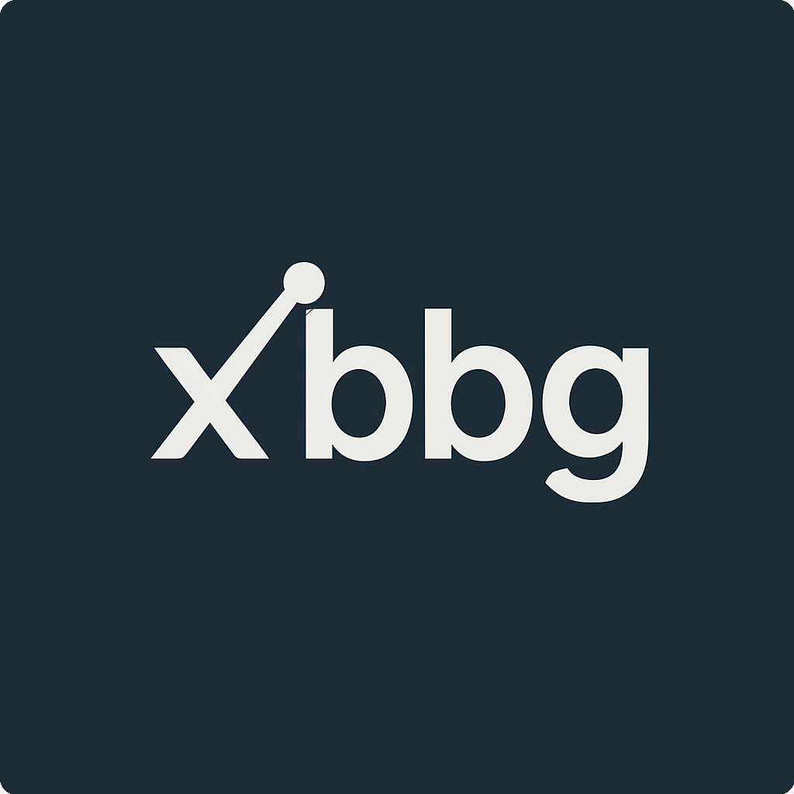

<!-- markdownlint-disable MD013 MD033 -->
<div align="center">

<a href="https://github.com/alpha-xone/xbbg"></a>

**xbbg: an intuitive Bloomberg API for Python, now Rust-powered**

[](https://pypi.org/project/xbbg/)
[](https://pypi.org/project/xbbg/)
[](https://github.com/alpha-xone/xbbg/blob/main/LICENSE)

Quick links: [Installation](#installation) · [Quickstart](#quickstart) · [Migration from 0x](#migration-from-0x) · [Contributing](CONTRIBUTING.md)

</div>

---

## Overview

`xbbg` is in an active **Rust alpha transition**. The public API is still Pythonic and familiar, but the core execution path is now implemented in Rust for better throughput, lower latency, and cleaner async behavior.

If you need the legacy pure-Python line, use the [`release/0.x`](https://github.com/alpha-xone/xbbg/tree/release/0.x) branch.

## What Changed in the Rust Alpha

- **Rust native extension** (`xbbg._core`) replaces the old pure-Python execution core.
- **Async-first internals** with sync wrappers for `bdp`, `bdh`, `bdib`, and related endpoints.
- **Modern packaging** based on `setuptools-rust` + `setuptools-scm`.
- **Multi-backend data layer** via `narwhals` (core dependencies stay minimal).
- **Ongoing parity work** with 0.x behavior while improving performance and reliability.

## Supported Functionality (Alpha)

- Reference data: `bdp`, `bds`
- Historical data: `bdh`
- Intraday bars and ticks: `bdib`, `bdtick`
- Query/search endpoints: `bql`, `bsrch`, `beqs`
- Streaming/subscriptions: `subscribe`, `stream` (+ async variants)
- Fixed income/options/CDX helpers under `xbbg.ext`

## Requirements

- Python `>=3.10,<3.15`
- Bloomberg connection (Terminal/DAPI or B-PIPE depending on your use case)
- Bloomberg SDK runtime available at import time for `xbbg._core`

The extension can resolve SDK runtime via one of:

1. `blpapi` package from Bloomberg index (recommended for most environments)
2. Local Bloomberg Terminal install (auto-detected on supported setups)
3. `BLPAPI_ROOT` environment variable pointing to Bloomberg C++ SDK

## Installation

Install `xbbg`:

```bash
pip install xbbg
```

Install Bloomberg `blpapi` bindings from the Bloomberg index:

```bash
pip install blpapi --index-url https://blpapi.bloomberg.com/repository/releases/python/simple/
```

Optional data tooling (if your workflows need it):

```bash
pip install pandas polars
```

## Quickstart

```python
from xbbg import bdp, bdh, bdib

# Reference snapshot
px = bdp(['AAPL US Equity', 'MSFT US Equity'], ['PX_LAST', 'SECURITY_NAME'])

# Historical daily bars
hist = bdh('SPX Index', 'PX_LAST', '2025-01-01', '2025-01-31')

# Intraday bars (1-minute default)
bars = bdib('AAPL US Equity', dt='2025-01-15')
```

Async usage:

```python
import asyncio
from xbbg import abdp

async def main():
    return await abdp('AAPL US Equity', 'PX_LAST')

data = asyncio.run(main())
```

## Migration from 0.x

The goal is practical compatibility, but this branch is still alpha. Expect incremental changes while we finish migration.

- Keep existing `bdp`/`bdh`/`bdib` call patterns where possible.
- Re-check environment setup for SDK runtime (`blpapi` or `BLPAPI_ROOT`).
- Prefer testing your critical workflows on `main` before full rollout.
- For strict legacy behavior, pin to 0.x from `release/0.x` until your migration is complete.

## Development

This repo is now built around `uv` and Rust tooling.

```bash
uv sync --extra dev
uv run pytest -m "not live"
```

For local editable install of the current package:

```bash
uv run python -m pip install -e .
```

## Roadmap

- Finalize API parity for common 0.x workflows
- Stabilize packaging and wheel matrix across platforms
- Expand docs/examples around async and extension modules
- Publish a stable v1 release after alpha hardening

## Contributing

Contributions are welcome. See [CONTRIBUTING.md](CONTRIBUTING.md) for setup, style, and workflow.

## License

Apache-2.0. See [LICENSE](LICENSE).
